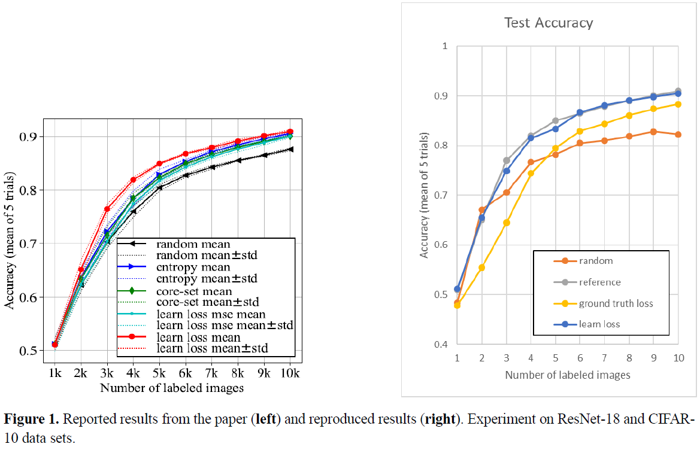

# Learning Loss for Active Learning
 Reproducing experimental results of LL4AL [Yoo et al. 2019 CVPR]

# Reproduced Results
 

# Requirements
 torch >= 1.1.0

 numpy >= 1.16.2

 tqdm >= 4.31.1

 visdom >= 0.1.8.8

# To Activate Visdom Server
  visdom -port 9000

  or 

  python -m visdom.server -port 9000

-> Currently, I set `vis` as None (Unable to run with google Colab)
(If you turn on the visdom server, you can get visualized charts)

# How to run

For CIFAR-10 :

`python main.py --dataset CIFAR-10`

For CIFAR-100 :

`python main.py --dataset CIFAR-100`
